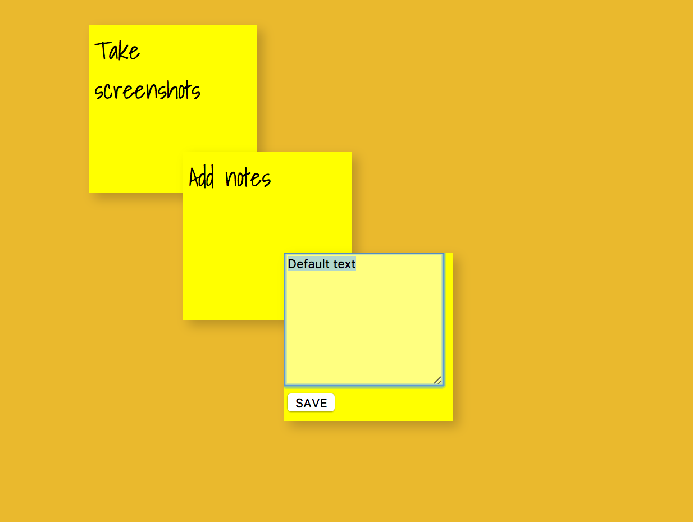

# Post-it notes

## Editable, draggable post-it notes in React

```
var Note = React.createClass({
  getInitialState() {
    return {editing: false}
  },
  componentWillMount() {
    this.style = {
      right: this.randomBetween(0, window.innerWidth - 150, 'px'),
      top: this.randomBetween(0, window.innerWidth - 150, 'px')
    }
  },
  componentDidUpdate() {
    if (this.state.editing) {
      this.refs.newText.focus()
      this.refs.newText.select()
    }
  },
  shouldComponentUpdate(nextProps, nextState) {
    return this.props.children !== nextProps.children || this.state !== nextState
  },
  randomBetween(x, y, s) {
    return (x + Math.ceil(Math.random() * (y - x))) + s
  },
  edit() {
    this.setState({editing: true})
  },
  save() {
    this.props.onChange(this.refs.newText.value, this.props.id)
    this.setState({editing: false})
  }
  ...
  ```
  
